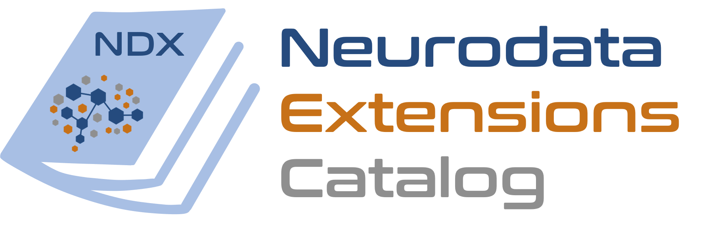

# ndx-photostim Extension for NWB

<div style="display:inline">


This is a <a href="https://www.nwb.org/">NeuroData Without Borders (NWB)</a> extension for storing data and metadata from <a href="https://www.nature.com/articles/nmeth.3217">holographic photostimulation</a>
methods. It includes containers for storing photostimulation-specific device parameters, holographic patterns 
(either 2D or 3D), and time series data related to photostimulation.
</div>

<br>We release six <a href="https://pynwb.readthedocs.io/en/stable/">PyNWB</a> containers as part of this extension (we currently only have a Python implementation, rather than both Python and a MATLAB ones):

* The `SpatialLightModulator` and `Laser` containers store metadata about the spatial light modulator and laser used in the photostimulation, respectively. These containers are then stored within the `PhotostimulationMethod` parent container, which stores the remaining photostimulation method-specifici metadata.
* `HolographicPattern` stores the **holographic pattern** used in stimulation.
* `PhotostimulationSeries` contains the **time series data** corresponding to the presentation of a given stimulus (where the stimulus is represented by a `HolographicPattern` container linked to the `PhotostimulationSeries`).
* We group **all time series & patterns for a given experiment** together using the `PhotostimulationTable` container. This object is a dynamic table, where each row in the table corresponds to a single `PhotostimulationSeries`. Additionally, the table links to the `StimulationDevice` used in the experiment.


## Background


State-of-the-art <a href="https://www.nature.com/articles/s41467-017-01031-3">holographic photostimulation methods</a>, used in concert with <a href="https://www.nature.com/articles/nmeth818">two-photon imaging</a>, 
allow unprecedented 
control and measurement of cell activity in the living brain. Methods for managing data for two-photon imaging 
experiments are improving, but there is little to no standardization of data for holographic stimulation methods. 
Stimulation in vivo depends on fine-tuning many experimental variables, which poses a challenge for reproducibility 
and data sharing between researchers. To improve <a href="https://www.sciencedirect.com/science/article/pii/S0896627321009557">standardization</a> of photostimulation data storage and processing, 
we release this extension as a generic data format for simultaneous holographic stimulation experiments, 
using the NWB format to store experimental details and data relating to both acquisition 
and photostimulation.

## Installation

To install the extension, first clone the `ndx_photostim` repository to the desired folder using the command
```angular2svg
git clone https://github.com/carlwharris/nwb-photostim.git
```
Then, to install the requisite python packages and extension, run:
```angular2svg
python -m pip install -r requirements.txt -r requirements-dev.txt
python setup.py install
```
The extension can then be imported into python scripts via `import ndx_photostim`.

## Usage

**For full example usage, see [tutorial.ipynb](./tutorial.ipynb)**

Below is example code to:
1. Create a device used in photostimulation
2. Simulate and store photostimulation ROIs
3. Store the time series corresponding to each stimulation
4. Record all time series and patterns used in an experiment in a table
5. Write the above to an NWB file and read it back


```python
import numpy as np
from dateutil.tz import tzlocal
from datetime import datetime
from pynwb import NWBFile, NWBHDF5IO
from ndx_photostim import SpatialLightModulator, Laser, PhotostimulationMethod, HolographicPattern, \
    PhotostimulationSeries, PhotostimulationTable

# create an example NWB file
nwbfile = NWBFile('nwb-photostim_example', 'EXAMPLE_ID', datetime.now(tzlocal()))

# store the spatial light modulator used
slm = SpatialLightModulator(name='slm',
                            model='Meadowlark',
                            size=np.array([512, 512]))

# store the laser used
laser = Laser(name='laser',
              model='Coherent Monaco',
              wavelength=1030,
              power=8,
              peak_pulse_energy=20,
              pulse_rate=500)

# create a container for the method used for photostimulation, and link the SLM and laser to it
ps_method = PhotostimulationMethod(name="methodA",
                                   stimulus_method="scanless",
                                   sweep_pattern="none",
                                   sweep_size=0,
                                   time_per_sweep=0,
                                   num_sweeps=0)
ps_method.add_slm(slm)
ps_method.add_laser(laser)

# define holographic pattern
hp = HolographicPattern(name='pattern1',
                        image_mask_roi=np.round(np.random.rand(5, 5)),
                        stim_duration=0.300,
                        power_per_target=8)

# show the mask
hp.show_mask()

# define stimulation time series using holographic pattern
ps_series = PhotostimulationSeries(name="series_1",
                            format='interval',
                            data=[1, -1, 1, -1],
                            timestamps=[0.5, 1, 2, 4],
                            pattern=hp,
                            method=ps_method)

# add the stimulus to the NWB file
nwbfile.add_stimulus(ps_series)

# create a table to store the time series/patterns for all stimuli together, along with experiment-specific
# parameters
stim_table = PhotostimulationTable(name='test', description='...')
stim_table.add_series(ps_series)

# plot the timestamps when the stimulus was presented
stim_table.plot_presentation_times()

# create a processing module and add the PresentationTable to it
module = nwbfile.create_processing_module(name="photostimulation", description="example photostimulation table")
module.add(stim_table)

# write to an NWB file and read it back
with NWBHDF5IO("example_file.nwb", "w") as io:
    io.write(nwbfile)

with NWBHDF5IO("example_file.nwb", "r", load_namespaces=True) as io:
    read_nwbfile = io.read()

    # Check the file & processing module
    print(read_nwbfile)
    print(read_nwbfile.processing['photostimulation'])

if os.path.exists("example_file.nwb"):
    os.remove("example_file.nwb")
```
## Running tests

<a href="https://pynwb.readthedocs.io/en/stable/software_process.html#continuous-integration">Unit and integration
tests</a> are implemented using <a href="https://docs.pytest.org/en/7.2.x/">pytest</a>, and can be run via the command 
`pytest` from the root of the extension directory. In addition, the
`pytest` command will also run a test of the example code above.

## Documentation

### Specification


Documentation for the extension's <a href="https://schema-language.readthedocs.io/en/latest/">specification</a>, which is based on the YAML files, is generated and stored in
the `./docs` folder. To create it, run the following from the home directory:
```angular2svg
cd docs
make fulldoc
```
This will save documentation to the `./docs/build` folder, and can be accessed via the 
`./docs/build/html/index.html` file.

### API

To generate documentation for the Python API (stores in `./api_docs`), we use <a href="https://www.sphinx-doc.org/en/master/">Sphinx</a> 
and a template from <a href="https://readthedocs.org/">ReadTheDocs</a>. API documentation can
be created by running 
```angular2svg
sphinx-build -b html api_docs/source/ api_docs/build/
```
from the home folder. Similar to the specification docs, API documentation is stored in `./api_docs/build`. Select 
`./api_docs/build/index.html` to access the API documentation in a website format.


## Credit

Code by Carl Harris and Paul LaFosse (equal contribution). Collaboration between the NIMH's [Data Science and Sharing Team](https://cmn.nimh.nih.gov/dsst) and [Histed Lab](https://www.nimh.nih.gov/research/research-conducted-at-nimh/research-areas/clinics-and-labs/ncb).


This extension was created using [ndx-template](https://github.com/nwb-extensions/ndx-template).

